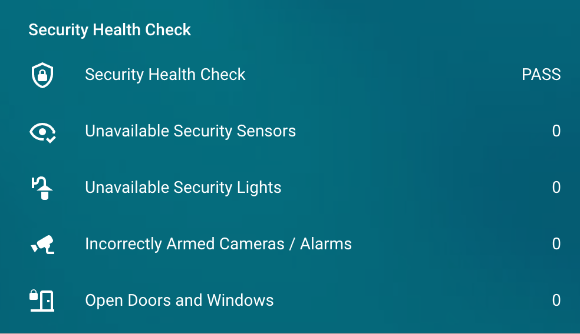

# Alarm Component

This section covers the Home Assistant alarm control panel called [Manual](https://www.home-assistant.io/integrations/manual/) and other alarm devices such as door and motion sensors. 

## :material-home-assistant:{ .homeassistant } Device Groups

Home Assistant [Groups](https://www.home-assistant.io/integrations/group/) are used to group similar devices together, for example, all motion sensors. 

### Alarm use cases

We will create groups to allow us to:

* Make sure devices are online such as motion and door sensors
* Check that all our doors are closed when we arm the alarm
* Check cameras and other alarms are armed correctly
* Check if everyone is home or not

<figure markdown>
  
  <figcaption>Security health check lovelace dashboard</figcaption>
</figure>


### Creating groups

First add a configuration block.

``` yaml title="configuration.yaml"
# Add a groups section
group: !include groups.yaml
```

Then create the groups in the `groups.yaml` file.

``` yaml title="groups.yaml"
# We can check this group to see if the house is empty
all_away:
  name: All Away
  entities:
    - person.jim
    - person.jill
  icon: mdi:airplane-takeoff

# For checking all security sensors are online
security_sensors:
  name: Security Sensors
  entities:
    - binary_sensor.garage_motion
    - binary_sensor.deck_motion
    - binary_sensor.back_door
    - binary_sensor.front_door

# For checking if all doors are closed
security_doors:
  name: Security Doors
  entities:
    - binary_sensor.back_door
    - binary_sensor.front_door

# For checking all our lights are online
security_lights:
  name: Security Lights
  entities:
    - light.garden
    - light.driveway

# For checking if all our alarms are armed correctly
security_alarms:
  name: Security Alarms
  entities:
    - alarm_control_panel.alexa_guard
    - alarm_control_panel.eufy_homebase
```

### Checking sensors are online

For this use case, we will check that all of the security sensors in the group `group.security_sensors` group are online and responding correctly according to Home Assistant.

To do this, we will create a [Template Sensor](https://www.home-assistant.io/integrations/template).

Make sure you have a template include in your Home Assistant configuration. 

``` yaml title="configuration.yaml"
# Add a groups section
template: !include template.yaml
```

Now add a template, which will count the amount of senors with the attribute `unavailable`, `unknown` or `none`, which will tell us if they are online or not.

``` yaml title="template.yaml"
- sensor:
  - name: "Unavailable Security Sensors"
    unique_id: "unavailable_security_sensors"
    # Checks the state of each security sensor, if its online, it adds it to a list, then we count the list.
    state: "{{ expand('group.security_sensors')|selectattr('state','in',['unavailable','unknown','none'])|list|count }}"
    icon: >
      
        mdi:eye-remove-outline
      
        mdi:eye-check-outline
      
```

### Checking doors are closed

This [Template Sensor](https://www.home-assistant.io/integrations/template) counts the number of open windows or doors in the group `group.security_doors`.

``` yaml title="template.yaml"
- sensor:
  - name: "Open Doors and Windows"
    unique_id: "open_doors_windows"
    # Returns 0 if no doors or windows are open
    state: "{{ expand('group.security_doors')|selectattr('state','in',['on'])|list|count }}"
    icon: >
      
        mdi:lock-open-outline
      
        mdi:door-closed-lock
      
```

### Checking other alarms

In my home I have other devices that are represented in alarms in Home Assistant, including an Amazon Echo Dot with [Alexa Guard](#alexa-guard) and some [Eufy Cameras](https://eu.eufylife.com/collections/security).

When I arm the Home Assistant alarm, these are also meant to be armed. 

This [Template Sensor](https://www.home-assistant.io/integrations/template) checks all alarms / cameras in the `group.security_alarms` group:

* If the HA alarm is `armed_away` or `armed_night`, all of them should be `armed_away`
* If the HA alarm is is *not* `armed_away` or `armed_night`, all of them should be either `armed_home` or `disarmed`

``` yaml title="template.yaml"
- sensor:
  - name: "Incorrectly Armed Cameras / Alarms"
    unique_id: "incorrectly_armed_cameras_and_alarms"
    state: >
      
        {{ expand('group.security_alarms')|list|count - expand('group.security_alarms')|selectattr('state','in',['armed_away'])|list|count }}
      
        {{ expand('group.security_alarms')|list|count - expand('group.security_alarms')|selectattr('state','in',['disarmed', 'armed_home'])|list|count }}
      
    icon: >
      
        mdi:cctv-off
      
        mdi:cctv
      
```

### Security health check

Using the data from our other template sensors, we can determine if our security devices are all as expected, and decide if our overall security health is a `PASS` or `FAIL`

``` yaml title="template.yaml"
- sensor:
  - name: "Security Health Check"
    unique_id: "security_health_check"
    state: >
        
          FAIL
        
          PASS
        
    icon: >
      
        mdi:shield-alert-outline
      
        mdi:shield-lock-outline
      
```